# ROS 2 Robot Description & Gazebo Simulation Notes

> A practical, end-to-end reference for building a robot description in ROS 2, visualizing it in RViz, modularizing it with Xacro, simulating it in Gazebo, bridging ROS 2 and Gazebo topics, and adding simulated sensors.

These notes consolidate the complete workflow developed during the **ROS 2 Beginners 2** learning path. The goal of this repository is not only to record commands, but to explain the reasoning behind the ROS 2 robot-description and simulation stack in a way that can be reused in future projects.

## What this repository covers

- TF frames and transform trees
- URDF links, joints, origins and robot structure
- `robot_state_publisher` and `/joint_states`
- Xacro properties, macros and modular robot descriptions
- Collision and inertial properties
- Gazebo Sim physics and systems/plugins
- Differential-drive and joint-state systems
- ROS 2 ↔ Gazebo bridging with `ros_gz_bridge`
- Custom Gazebo worlds
- Simulated camera integration
- A reusable workflow for starting a robot-description project from scratch

> **Environment used in these notes:** ROS 2 Jazzy and Gazebo Sim / Harmonic-era tooling. Commands and package names may differ slightly on other ROS 2 or Gazebo releases.

---

## Table of Contents

1. [Transforms (TF)](#1-transforms-tf)
2. [URDF Files](#2-urdf-files)
3. [robot_state_publisher](#3-robot_state_publisher)
4. [Improving URDF with Xacro](#4-improving-urdf-with-xacro)
5. [Simulating with Gazebo](#5-simulating-with-gazebo)
   - [5.1 Physics, inertia and collision](#51-physics-inertia-and-collision)
   - [5.2 Gazebo systems / plugins](#52-gazebo-systems--plugins)
   - [5.3 ROS 2 ↔ Gazebo bridge](#53-ros-2--gazebo-bridge)
   - [5.4 Creating a Gazebo world](#54-creating-a-gazebo-world)
6. [Adding a Camera Sensor](#6-adding-a-camera-sensor)
7. [Final Project: Reusable Workflow](#7-final-project-reusable-workflow)
8. [Useful CLI Commands](#8-useful-cli-commands)

---

# 1. Transforms (TF)

A **transform (TF)** describes the spatial relationship between two coordinate frames. Every relevant robot component can have its own frame, and a transform expresses the **translation** and **rotation** required to relate one frame to another.

A robot therefore becomes a tree of coordinate frames connected by parent-child relationships. Keeping this tree coherent is fundamental: perception, localization, motion planning, visualization and control all depend on knowing where each frame is relative to the others.

```text
parent frame
    │
    │  translation + rotation
    ▼
child frame
```

To launch the standard URDF tutorial example in RViz:

```bash
ros2 launch urdf_tutorial display.launch.py \
  model:=/opt/ros/jazzy/share/urdf_tutorial/urdf/08-macroed.urdf.xacro
```

<p align="center">
  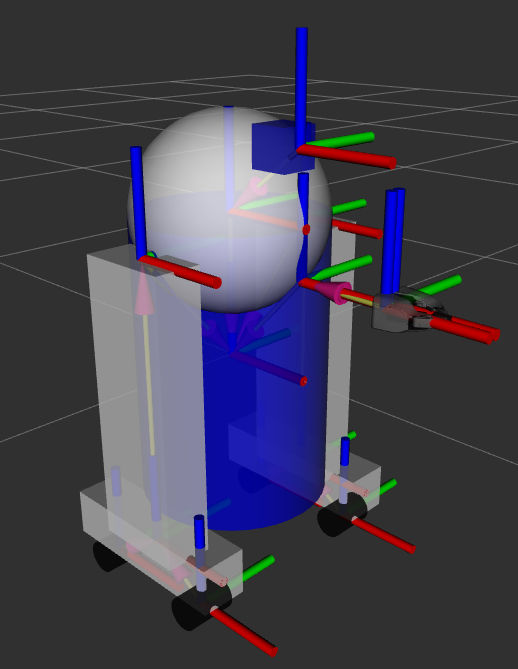
</p>

<p align="center"><em>Robot model visualized together with its coordinate frames.</em></p>

<p align="center">
  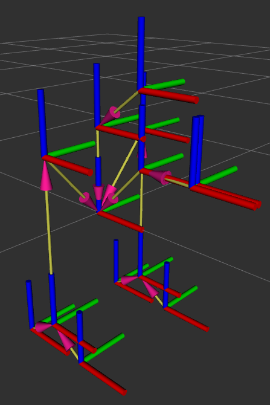
</p>

<p align="center"><em>Frames visualized without the robot geometry, making the TF relationships easier to inspect.</em></p>

<p align="center">
  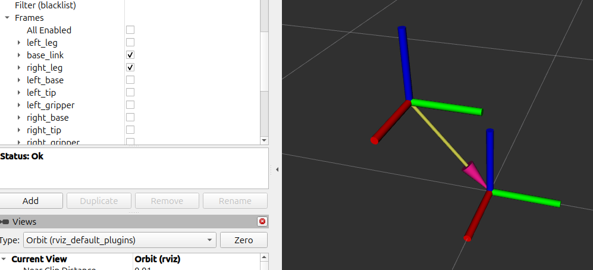
</p>

<p align="center"><em>Example of a parent-child frame relationship in RViz.</em></p>

<p align="center">
  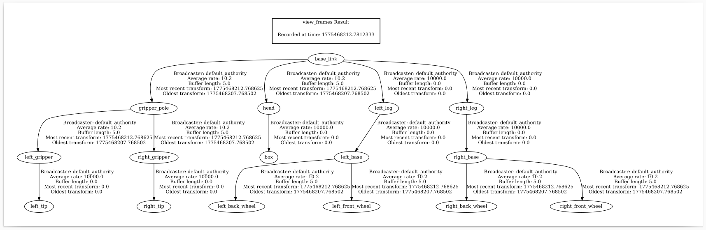
</p>

<p align="center"><em>Generated TF tree showing the frame hierarchy.</em></p>

<p align="center">
  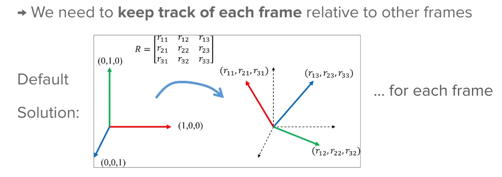
</p>

<p align="center"><em>A transform can be understood as translation plus rotation.</em></p>

To generate a PDF representation of the current TF tree:

```bash
ros2 run tf2_tools view_frames
```

### Key takeaway

You normally do **not** calculate and publish every transform manually. Instead, define the robot structure in URDF/Xacro and let ROS 2 components such as `robot_state_publisher` compute and broadcast the corresponding transforms.

---

# 2. URDF Files

**URDF** stands for **Unified Robot Description Format**. It is an XML-based format used to describe the structure of a robot.

At its core, a URDF defines:

- **Links** — rigid bodies that make up the robot.
- **Joints** — relationships between links.
- **Geometry** — visual shape of each link.
- **Frames / origins** — relative position and orientation between elements.
- **Collision geometry** — shape used by a physics engine for collision detection.
- **Inertial properties** — mass and inertia used in dynamic simulation.

A minimal link might look conceptually like this:

```xml
<link name="base_link">
  <visual>
    <geometry>
      <box size="0.6 0.4 0.2"/>
    </geometry>
  </visual>
</link>
```

The most important skill when starting with URDF is learning how to connect two links through a joint and reason about their coordinate systems.

To visualize a URDF with the tutorial launch file:

```bash
ros2 launch urdf_tutorial display.launch.py \
  model:=/absolute/path/to/my_robot.urdf
```

<p align="center">
  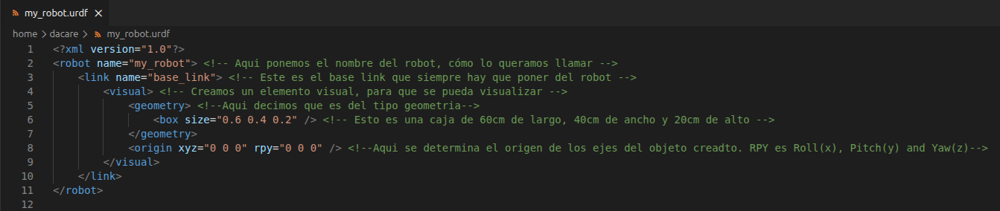
</p>

<p align="center"><em>Initial URDF example written in XML.</em></p>

## 2.1 A systematic method for positioning links

When assembling links, a reliable workflow is:

1. Start with the relevant translation and rotation origins set to zero.
2. Position the **joint frame** first.
3. Once the joint/TF is correct, adjust the child link's `<visual><origin .../></visual>` so that its geometry sits correctly relative to that frame.

This separation is important: the joint defines the kinematic relationship, while the visual origin places the geometry relative to the link frame.

<p align="center">
  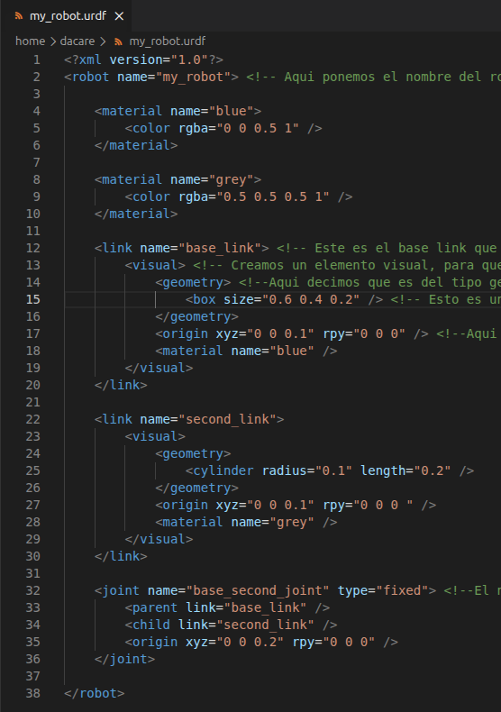
</p>

<p align="center"><em>Example with two links connected by a joint.</em></p>

## 2.2 Common joint types

| Joint type | Degrees of freedom | Typical use |
|---|---:|---|
| `fixed` | 0 | Rigidly attach two links |
| `revolute` | 1 rotational | Bounded rotary joint |
| `continuous` | 1 rotational | Wheel or unlimited rotary joint |
| `prismatic` | 1 translational | Linear actuator / slider |

For a revolute joint, the `<axis>` element determines the axis of rotation, while `<limit>` defines constraints such as lower/upper position, velocity and effort limits.

<p align="center">
  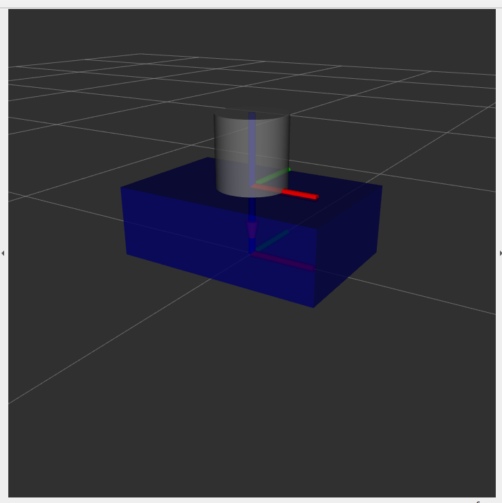
</p>

<p align="center"><em>First robot geometry visualized in RViz while learning link and joint placement.</em></p>

## 2.3 First complete mobile-base model

The first complete model contains a main chassis, two drive wheels, a caster wheel and a `base_footprint` frame used as a convenient ground-level reference.

<p align="center">
  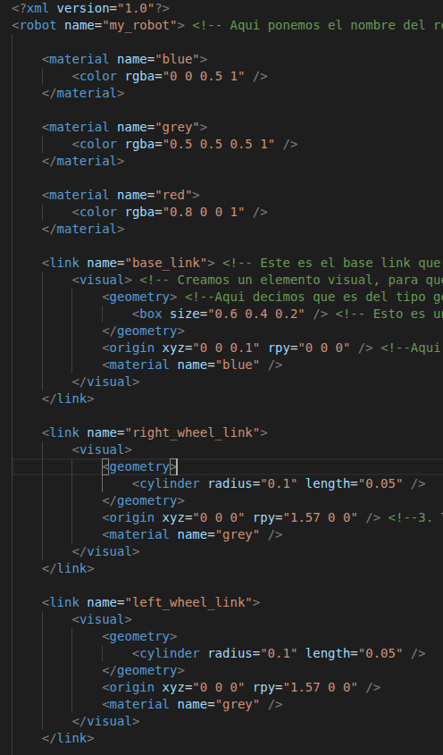
</p>

<p align="center"><em>URDF source for the first complete mobile-base model.</em></p>

<p align="center">
  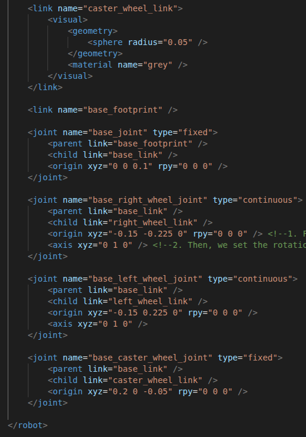
</p>

<p align="center"><em>Resulting robot model visualized in RViz.</em></p>

<p align="center">
  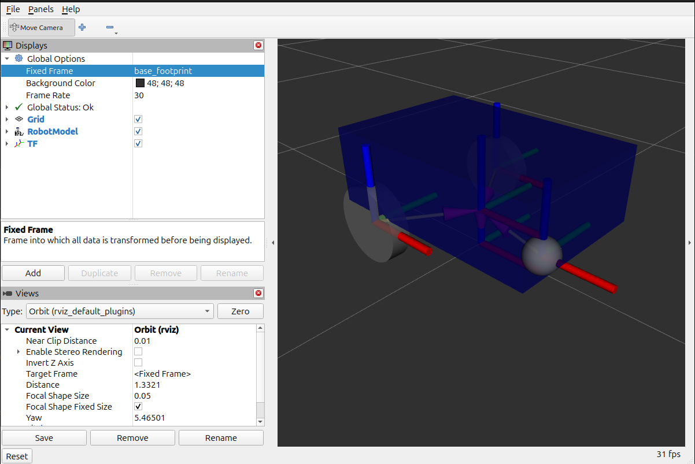
</p>

<p align="center"><em>TF frames of the completed model.</em></p>

<p align="center">
  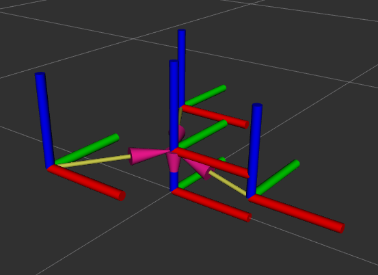
</p>

<p align="center"><em>Additional TF visualization from the original notes.</em></p>

### Key takeaway

Treat URDF as the **structural and physical description of the robot**. A clean frame hierarchy and well-defined joints are more important than visually perfect geometry during the first iteration.

---

# 3. `robot_state_publisher`

`robot_state_publisher` connects the robot description with the current joint configuration to generate the TF tree.

```text
           robot_description (URDF/Xacro)
                       │
                       ▼
/joint_states ──► robot_state_publisher ──► /tf + /tf_static
```

- `robot_description` provides the robot's kinematic structure.
- `/joint_states` provides the current positions of movable joints.
- `robot_state_publisher` uses both to calculate and publish transforms between links.

<p align="center">
  
</p>

<p align="center"><em>Relationship between `/joint_states`, the URDF and `robot_state_publisher`.</em></p>

<p align="center">
  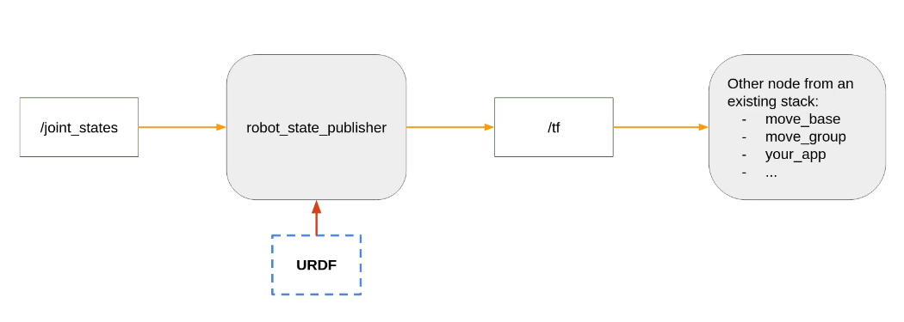
</p>

<p align="center"><em>TF data can then be consumed by other parts of the robot software stack.</em></p>

## 3.1 Starting `robot_state_publisher`

```bash
ros2 run robot_state_publisher robot_state_publisher \
  --ros-args -p robot_description:="$(xacro my_robot.urdf)"
```

<p align="center">
  
</p>

<p align="center"><em>Starting `robot_state_publisher` from the command line.</em></p>

<p align="center">
  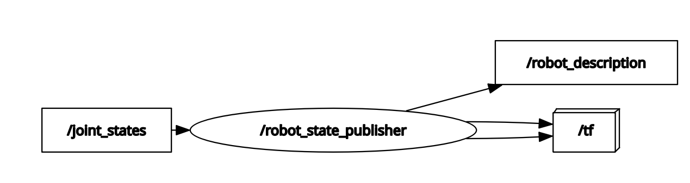
</p>

<p align="center"><em>ROS graph after starting the robot state publisher.</em></p>

## 3.2 Manually exercising joints in RViz

For visualization and URDF debugging, `joint_state_publisher_gui` can publish artificial joint states:

```bash
ros2 run joint_state_publisher_gui joint_state_publisher_gui
```

<p align="center">
  
</p>

<p align="center"><em>Launching `joint_state_publisher_gui`.</em></p>

This is useful for **kinematic visualization**, but it should not be confused with a physics simulation. In Gazebo, joint states should instead come from the simulated mechanism.

```bash
ros2 run rviz2 rviz2
```

<p align="center">
  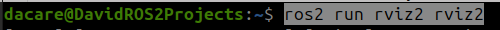
</p>

<p align="center"><em>Launching RViz.</em></p>

```bash
mv my_robot.urdf ros2_ws/src/my_robot_description/urdf/
```

<p align="center">
  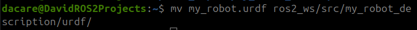
</p>

<p align="center"><em>Moving the robot description into the package structure.</em></p>

```bash
ros2 run rviz2 rviz2 -d urdf_config.rviz
```

<p align="center">
  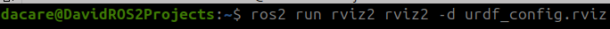
</p>

<p align="center"><em>Launching RViz with a saved configuration.</em></p>

## 3.3 Launch-file integration

Once the individual commands work, consolidate them into a launch file so the robot description, joint-state source and RViz configuration can be started consistently.

<p align="center">
  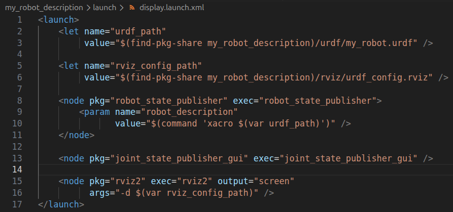
</p>

<p align="center"><em>Example launch file combining the robot description, joint-state GUI and RViz.</em></p>

### Key takeaway

A repeatable ROS 2 project should avoid requiring several manual terminal commands. Once the nodes and parameters are understood, move them into launch files.

---

# 4. Improving URDF with Xacro

**Xacro** adds macro and expression capabilities to XML robot descriptions. It makes large robot models easier to maintain, parameterize and reuse.

Typical benefits include centralizing dimensions as properties, using mathematical expressions instead of hard-coded constants, creating reusable macros, generating repeated components and splitting a large description into smaller files.

## 4.1 Enabling Xacro

<p align="center">
  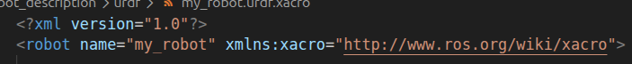
</p>

<p align="center"><em>Enabling the Xacro XML namespace.</em></p>

<p align="center">
  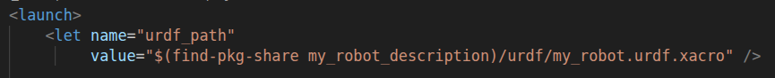
</p>

<p align="center"><em>Referencing the Xacro file from the launch configuration.</em></p>

Xacro expressions make intent clearer. For example, a 90° rotation can be written using π instead of a hard-coded approximation:

<p align="center">
  
</p>

<p align="center"><em>Using `${pi / 2.0}` for a 90-degree rotation.</em></p>

## 4.2 Properties

<p align="center">
  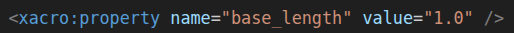
</p>

<p align="center"><em>Defining the robot base length as a Xacro property.</em></p>

<p align="center">
  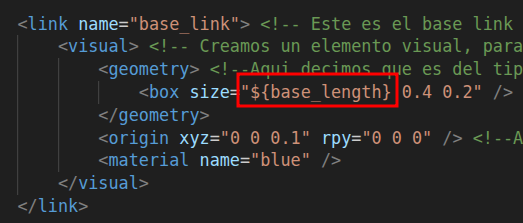
</p>

<p align="center"><em>Using the property inside the link geometry.</em></p>

<p align="center">
  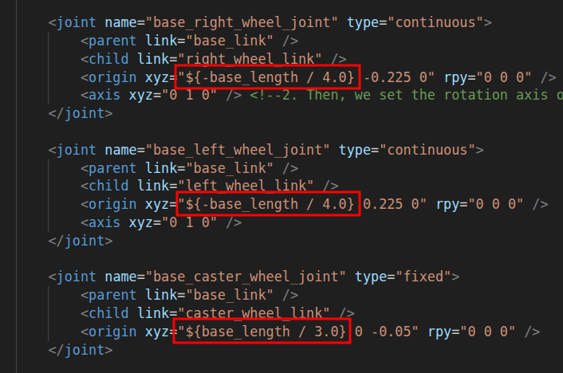
</p>

<p align="center"><em>Computing joint positions from the base-length property.</em></p>

The practical advantage is significant: changing one dimension at the top of the file can update the entire robot consistently.

## 4.3 Macros

A Xacro macro is conceptually similar to a function: it receives parameters and expands into XML.

<p align="center">
  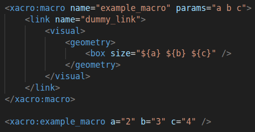
</p>

<p align="center"><em>Minimal Xacro macro example and invocation.</em></p>

A strong use case is repeated geometry such as left/right wheels. A `prefix` parameter allows the same macro to generate uniquely named links and joints.

<p align="center">
  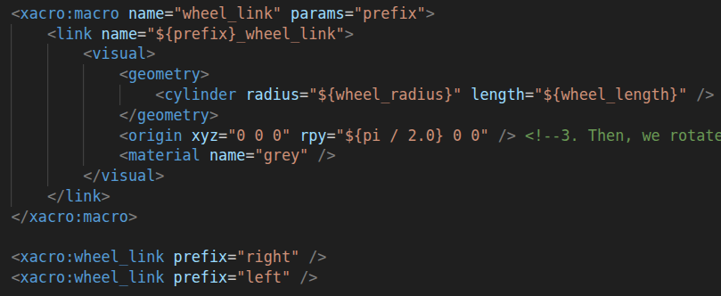
</p>

<p align="center"><em>Reusable wheel macro with a prefix for left/right instances.</em></p>

## 4.4 Splitting the robot into multiple files

<p align="center">
  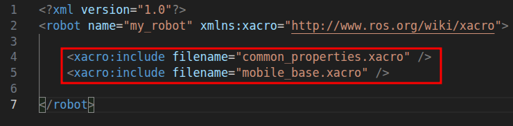
</p>

<p align="center"><em>Including component Xacro files from the main robot description.</em></p>

<p align="center">
  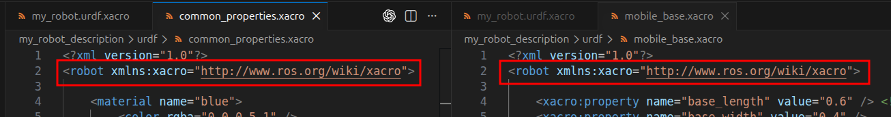
</p>

<p align="center"><em>Example of the resulting modular file structure / included content.</em></p>

```bash
ros2 param get /robot_state_publisher robot_description
```

<p align="center">
  
</p>

<p align="center"><em>Inspecting the expanded `robot_description` parameter.</em></p>

### Key takeaway

Use plain URDF to understand the model; use Xacro to make the model **maintainable**.

---

# 5. Simulating with Gazebo

RViz and Gazebo solve different problems:

| Tool | Primary purpose |
|---|---|
| RViz | Visualize robot state, TFs, sensor data and debugging information |
| Gazebo Sim | Simulate the robot and its environment with physics and simulated systems/sensors |

Gazebo can model gravity, contacts, collisions, inertia and actuator behavior. It therefore gives the robot description a **physical context**.

```text
URDF / Xacro
    │
    ▼
Gazebo creates the simulated mechanism
    │
    ├── physics: mass, inertia, gravity, collision, friction
    ├── systems/plugins: drive, joint control, sensors, state publication
    └── Gazebo Transport topics
                  │
                  ▼
             ros_gz_bridge
                  │
                  ▼
              ROS 2 topics
```

```bash
gz sim
gz topic -l
ros2 launch ros_gz_sim gz_sim.launch.py gz_args:=empty.sdf
```

<p align="center">
  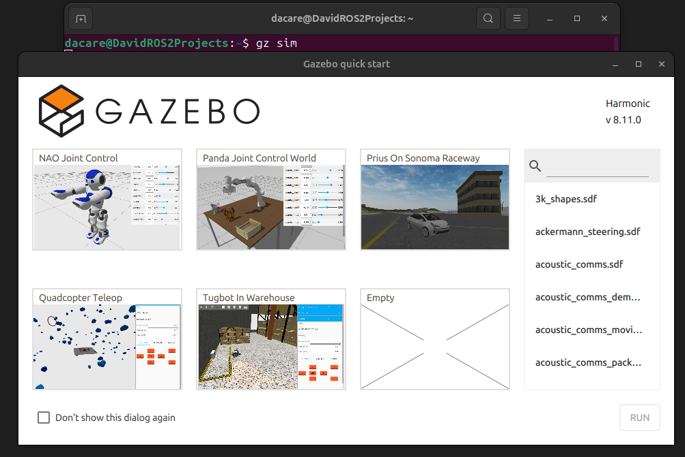
</p>

<p align="center"><em>Gazebo Sim quick-start interface.</em></p>

<p align="center">
  
</p>

<p align="center"><em>Gazebo systems communicate with the ROS 2 side through `ros_gz_bridge`.</em></p>

## 5.1 Physics, inertia and collision

A robot that only has visual geometry may look correct in RViz but still be incomplete for physics simulation. Gazebo needs physically meaningful properties.

### Inertia

<p align="center">
  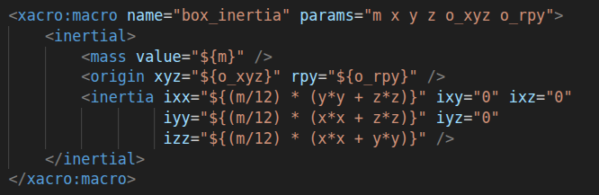
</p>

<p align="center"><em>Box inertia macro.</em></p>

<p align="center">
  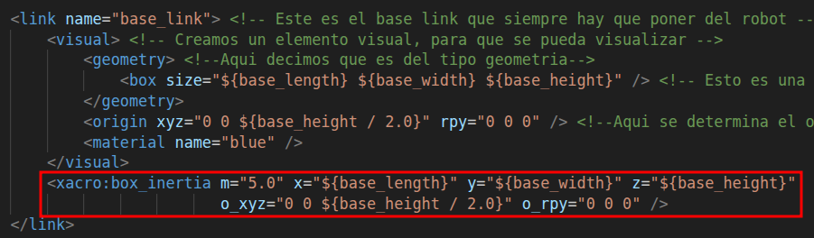
</p>

<p align="center"><em>Applying the inertia macro to the robot base.</em></p>

### Collision geometry

Collision geometry is defined separately from visual geometry. For simple shapes it often mirrors the visual dimensions, but it may be deliberately simplified for more robust or efficient simulation.

<p align="center">
  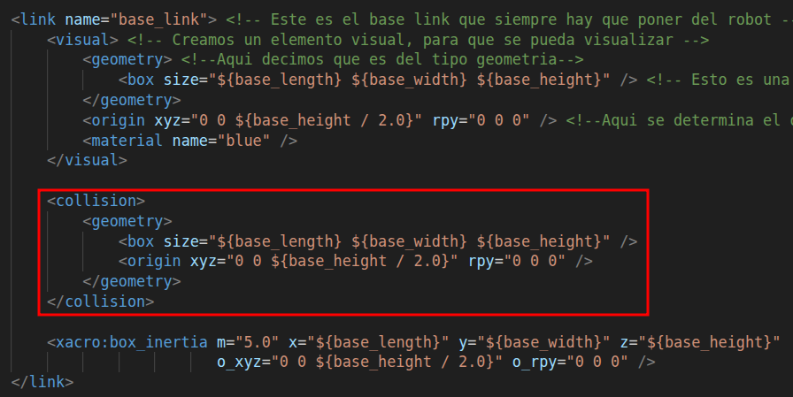
</p>

<p align="center"><em>Collision geometry added to the base link.</em></p>

<p align="center">
  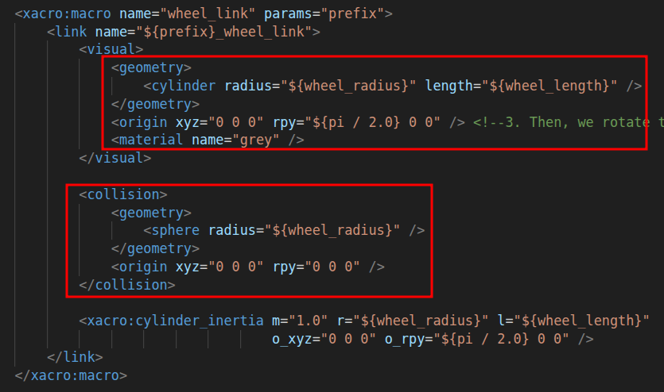
</p>

<p align="center"><em>Simplified collision geometry for a cylindrical component.</em></p>

### Launching the simulation

<p align="center">
  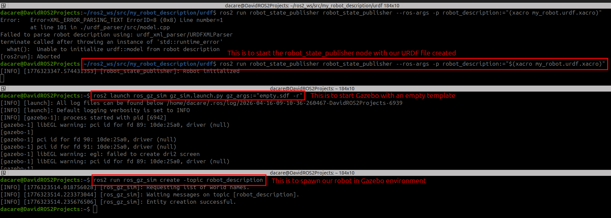
</p>

<p align="center"><em>Launch configuration used to start the Gazebo simulation.</em></p>

The `-r` Gazebo argument starts the simulation in the running state:

<p align="center">
  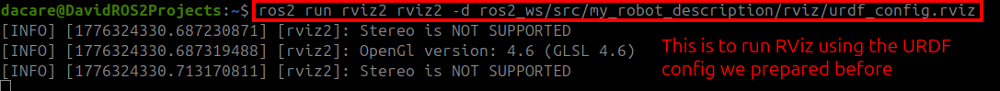
</p>

<p align="center"><em>CLI invocation including the run option.</em></p>

<p align="center">
  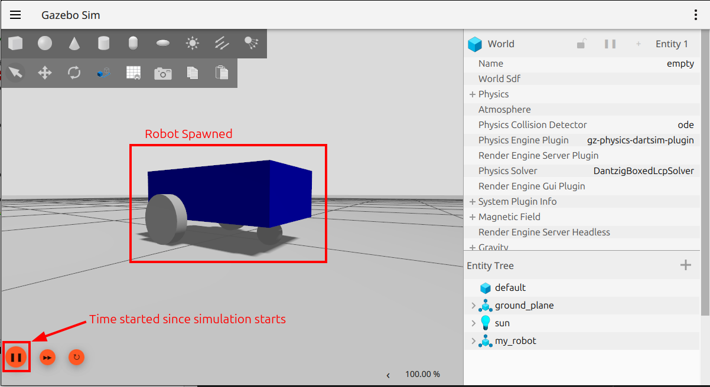
</p>

<p align="center"><em>Robot spawned in Gazebo.</em></p>

<p align="center">
  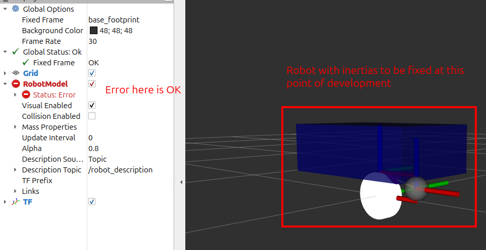
</p>

<p align="center"><em>Robot visualized in RViz while the simulation is running.</em></p>

<p align="center">
  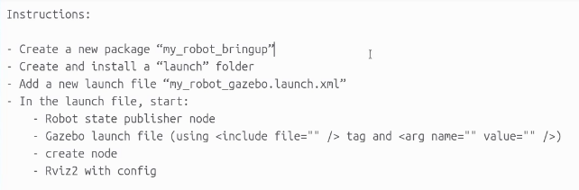
</p>

<p align="center"><em>Implementation task used to consolidate the simulation setup.</em></p>

## 5.2 Gazebo systems / plugins

Gazebo **systems** (often informally called plugins) add runtime behavior to the simulation. They can implement drive kinematics, controllers, state publishers, sensors and many other capabilities.

### Differential drive

<p align="center">
  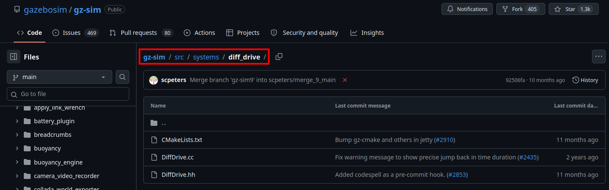
</p>

<p align="center"><em>Gazebo DiffDrive system documentation/source reference.</em></p>

<p align="center">
  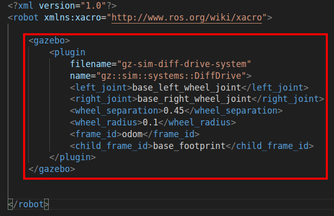
</p>

<p align="center"><em>DiffDrive system added to the robot description.</em></p>

<p align="center">
  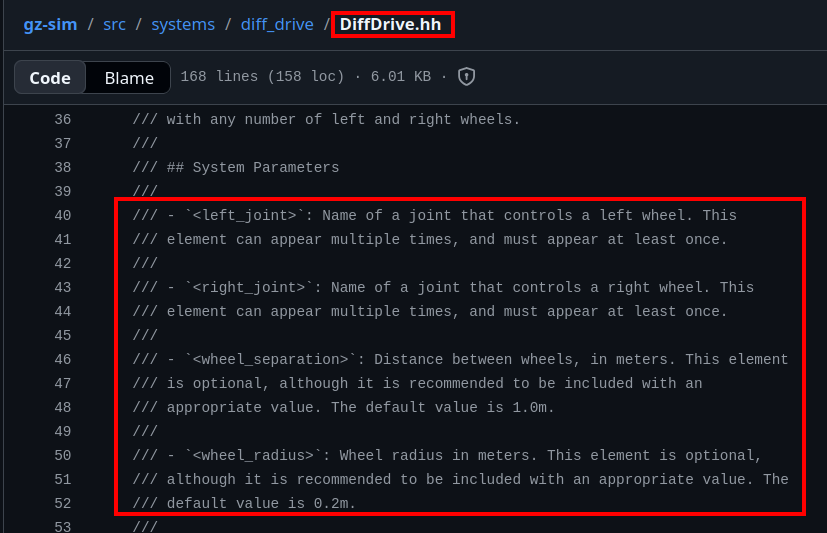
</p>

<p align="center"><em>DiffDrive system parameters documented in the source.</em></p>

<p align="center">
  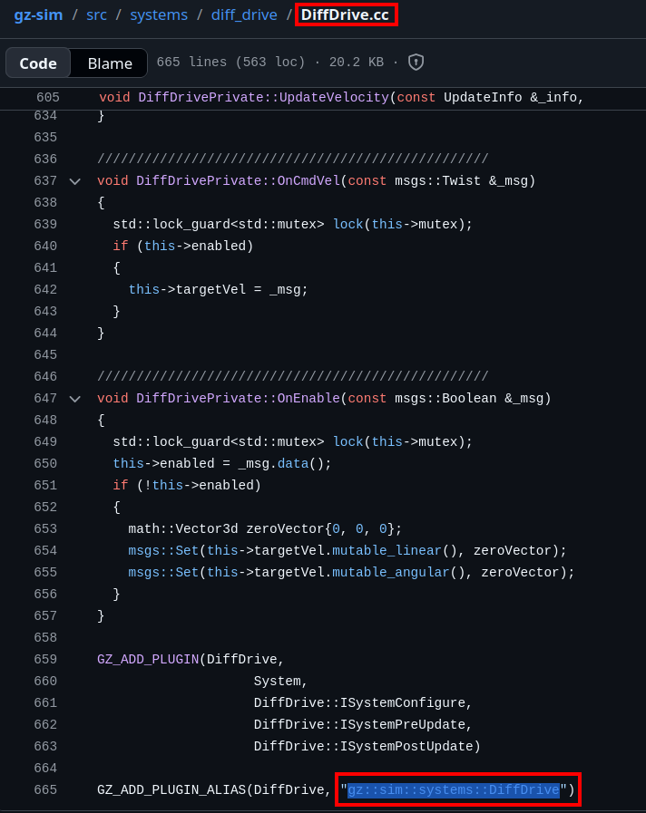
</p>

<p align="center"><em>Gazebo system implementation and registration information.</em></p>

<p align="center">
  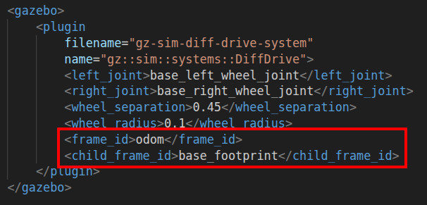
</p>

<p align="center"><em>DiffDrive odometry and frame configuration.</em></p>

### Odometry

Odometry estimates how the robot pose changes over time. In a typical mobile-base frame tree, the relationship between `odom` and `base_footprint` / `base_link` expresses that accumulated motion estimate.

### Simulated joint states

<p align="center">
  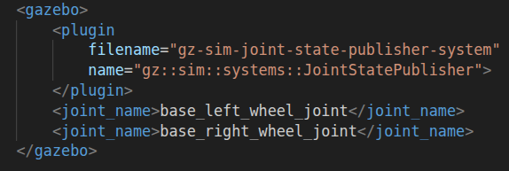
</p>

<p align="center"><em>Gazebo JointStatePublisher system configured for the drive-wheel joints.</em></p>

```text
Gazebo physics
    │
    ▼
actual simulated joint positions
    │
    ▼
JointStatePublisher system
    │
    ▼
Gazebo joint-state topic
    │
    ▼
ros_gz_bridge
    │
    ▼
/joint_states
    │
    ▼
robot_state_publisher
    │
    ▼
/tf
```

### Contact / friction tuning

<p align="center">
  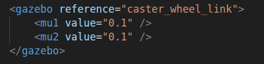
</p>

<p align="center"><em>Friction parameters applied to the caster wheel.</em></p>

## 5.3 ROS 2 ↔ Gazebo bridge

Gazebo Transport and ROS 2 are separate communication systems. `ros_gz_bridge` converts selected topics and message types between them.

<p align="center">
  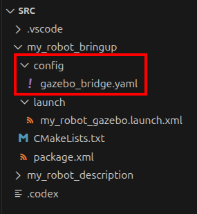
</p>

<p align="center"><em>Bridge YAML stored in the bringup package configuration directory.</em></p>

<p align="center">
  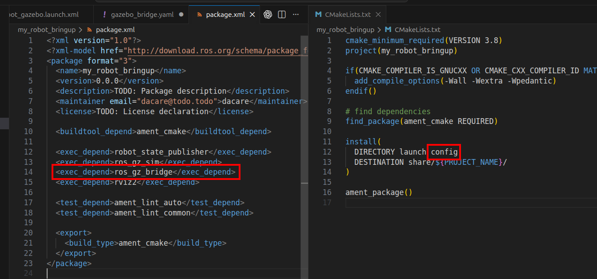
</p>

<p align="center"><em>Package and build-system changes required for bridge configuration.</em></p>

<p align="center">
  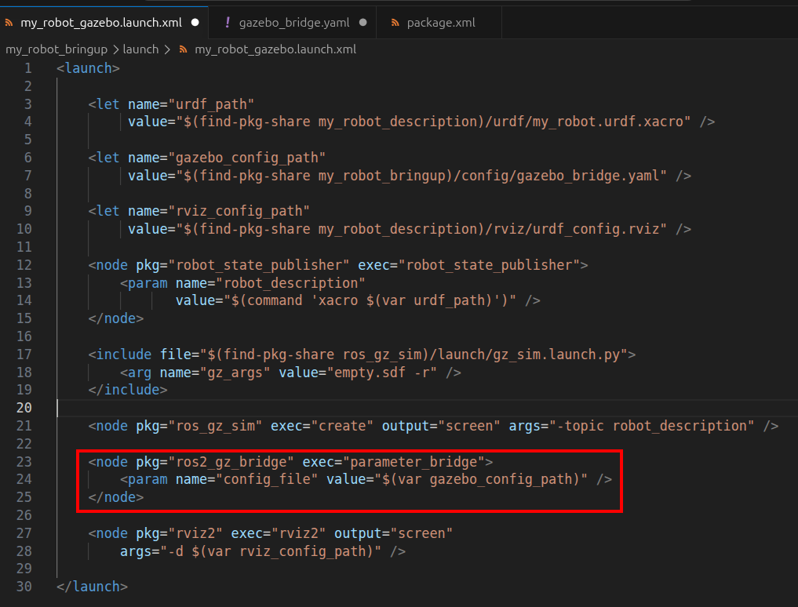
</p>

<p align="center"><em>Launching the parameter bridge from the robot bringup launch file.</em></p>

A bridge YAML entry maps a ROS 2 topic name, a Gazebo topic name, both message types and the communication direction.

<p align="center">
  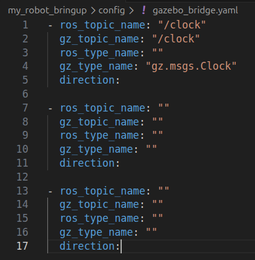
</p>

<p align="center"><em>Example Gazebo bridge YAML configuration.</em></p>

### Bridge direction matters

For commands sent **from ROS 2 to Gazebo**, use the ROS-to-Gazebo direction. For simulated state or sensor data sent **from Gazebo to ROS 2**, use the opposite direction.

A topic appearing in `ros2 topic list` does not by itself prove that the bridge is listening in the direction required by your publisher.

```bash
# ROS 2 introspection
ros2 topic list
ros2 topic info /topic_name -v

# Gazebo Transport introspection
gz topic -l
gz topic -i -t /topic_name
```

<p align="center">
  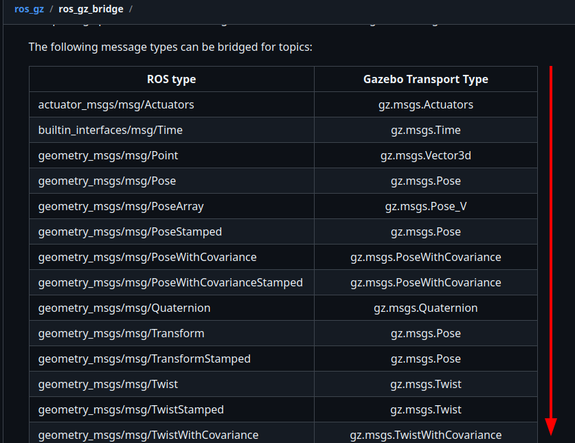
</p>

<p align="center"><em>Reference table for bridge-compatible ROS 2 and Gazebo message types.</em></p>

<p align="center">
  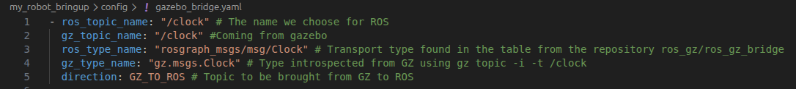
</p>

<p align="center"><em>Additional bridge configuration example.</em></p>

## 5.4 Creating a Gazebo world

<p align="center">
  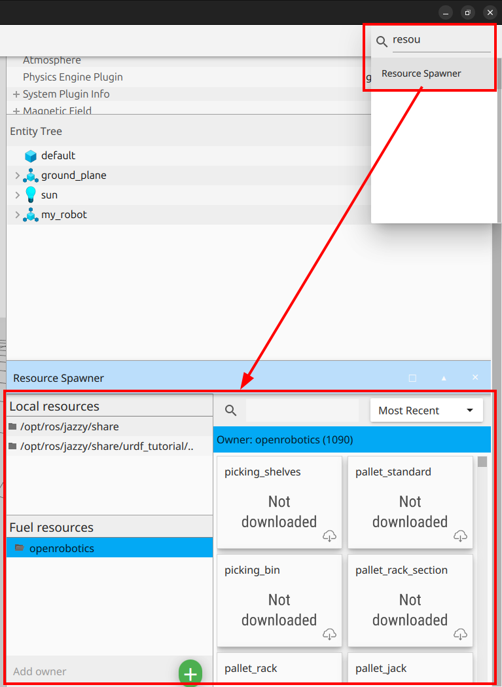
</p>

<p align="center"><em>Adding the Resource Spawner from the Gazebo GUI.</em></p>

Models can be obtained from Gazebo Fuel and custom mesh assets can be inserted into the environment. When a custom world becomes part of the project, store it in a `worlds/` directory inside the bringup package, install that directory and reference the world from the launch configuration.

<p align="center">
  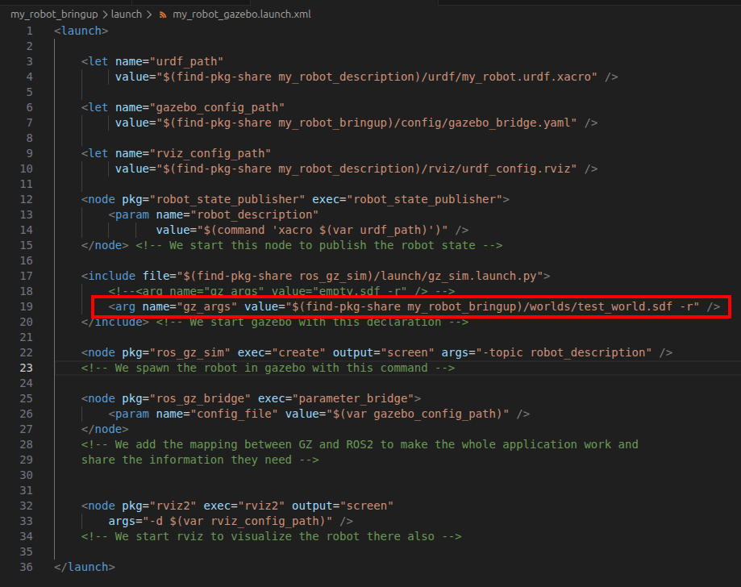
</p>

<p align="center"><em>Launching/spawning the robot into the custom Gazebo world.</em></p>

### Key takeaway

The URDF/Xacro tells Gazebo **what the robot is**. Gazebo systems/plugins determine **how it behaves or interfaces with the simulation**. The physics engine calculates how the mechanism actually responds, and the bridge exposes the selected simulation interfaces to ROS 2.

---

# 6. Adding a Camera Sensor

A simulated sensor is best treated as its own modular robot-description component.

<p align="center">
  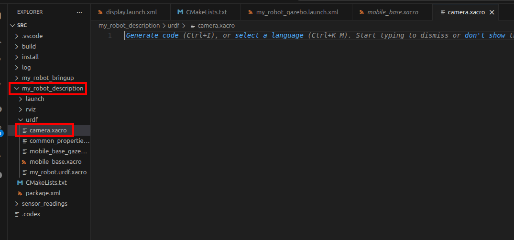
</p>

<p align="center"><em>Dedicated camera Xacro file inside the robot-description package.</em></p>

<p align="center">
  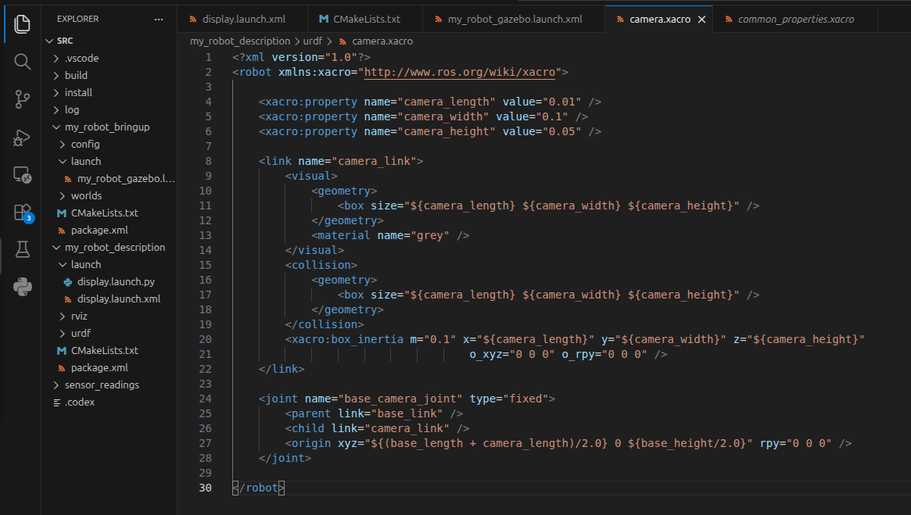
</p>

<p align="center"><em>Camera link, collision/inertia and fixed joint definition.</em></p>

The camera component is then included from the main robot description:

<p align="center">
  
</p>

<p align="center"><em>Including `camera.xacro` from the main robot Xacro file.</em></p>

The next step is adding the appropriate Gazebo sensor/system configuration so the simulated camera produces data. Once the Gazebo image and camera-info topics exist, bridge the required topics to ROS 2 so nodes can consume them as standard ROS messages.

```bash
ros2 topic list | grep camera
ros2 topic info /camera/image_raw
ros2 topic echo /camera/camera_info
```

### Key takeaway

Keep sensors modular: **robot geometry + Gazebo sensor behavior + topic bridge** are three separate concerns that should be configured deliberately.

---

# 7. Final Project: Reusable Workflow

The final project consolidates the course into a repeatable development sequence.

1. **Create the robot-description package.** Include URDF/Xacro files, RViz configuration and launch files.
2. **Define the links.** Focus first on structure and naming rather than perfect offsets.
3. **Define the joints.** Establish the parent-child tree, joint type and motion axis.
4. **Validate the kinematic structure in RViz.** Position the joint frame first, then adjust the visual origin of the child geometry.
5. **Add physical properties.** Collision geometry, mass, inertia and contact/friction properties where required.
6. **Build a repeatable launch flow.** Start the robot description and visualization consistently.
7. **Spawn the robot in a simple Gazebo world first.** Catch missing inertia/collision problems before adding environmental complexity.
8. **Add Gazebo systems/plugins.** Drive systems, controllers, joint-state publication and sensors.
9. **Launch the robot in the target world.**
10. **Bridge the required Gazebo and ROS 2 topics.** Determine source/destination, message types and bridge direction.
11. **Test every interface explicitly.** Publish commands, echo state topics, inspect endpoints, inspect TF and validate behavior in Gazebo and RViz.

## Mental model to keep

```text
URDF / Xacro
  = robot structure and physical description

Gazebo
  = simulated world + physics engine

Gazebo systems/plugins
  = simulated behavior, controllers and sensors

ros_gz_bridge
  = selected communication between Gazebo Transport and ROS 2

/joint_states + robot_description
  └──► robot_state_publisher
         └──► /tf
```

This separation of responsibilities is one of the most important architectural ideas in the entire workflow.

---

# 8. Useful CLI Commands

## TF and robot description

```bash
ros2 run tf2_tools view_frames
ros2 param get /robot_state_publisher robot_description
```

## ROS 2 graph and topics

```bash
ros2 node list
ros2 topic list
ros2 topic info /topic_name
ros2 topic info /topic_name -v
ros2 topic echo /topic_name
ros2 topic type /topic_name
ros2 interface show geometry_msgs/msg/Twist
rqt_graph
```

## RViz

```bash
ros2 run rviz2 rviz2
ros2 run rviz2 rviz2 -d urdf_config.rviz
```

## Manual joint-state visualization

```bash
ros2 run joint_state_publisher_gui joint_state_publisher_gui
```

## Gazebo

```bash
gz sim
gz topic -l
gz topic -i -t /topic_name
```

## Example command publication

```bash
ros2 topic pub -1 /cmd_vel geometry_msgs/msg/Twist \
  "{linear: {x: 0.2, y: 0.0, z: 0.0}, angular: {x: 0.0, y: 0.0, z: 0.0}}"

ros2 topic pub -1 /joint_name/cmd_pos std_msgs/msg/Float64 "{data: 1.0}"
```

---

## Repository philosophy

These notes are intentionally organized around **understanding the data flow** rather than memorizing commands. When debugging, identify which layer owns the problem:

```text
Description problem?   -> URDF / Xacro
Frame problem?         -> TF / robot_state_publisher
Physics problem?       -> Gazebo + inertia/collision/contact
Behavior problem?      -> Gazebo system/plugin/controller
Communication problem? -> ros_gz_bridge + topic/type/direction
Visualization problem? -> RViz configuration / TF availability
```

That approach scales far better than trial-and-error as robot projects become more complex.

---

## Source note

This document is a cleaned, reorganized and expanded version of personal learning notes created while following a ROS 2 beginner course. **All screenshots from the supplied notes have been preserved** as practical implementation references.
